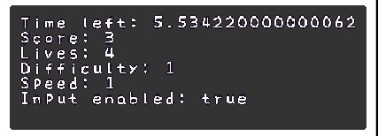

# Guide on "how to contribute your own game to KAPLAYware"

Welcome to the KAPLAYware contributing guide! We'll go over these points

### 1. [How do i add a game?](#how-do-i-add-a-game)
### 2. [What is a minigame context?](#what-is-a-minigame-context)
### 3. [How do i develop said game? AKA start()](#how-do-i-develop-said-game)
### 4. [Do's and Don'ts](#dos-and-donts)
### 5. [Debug and advanced testing](#debug-and-advanced-testing)
### 6. [Conclusion](#conclusion)

# How do i add a game??
First, you must clone the repository and do all the git usual things.

You fork the repository, then you clone it in your pc, you make changes, you commit you push and you make a pull request! You can find more here: [Contributing to a project](https://docs.github.com/en/get-started/exploring-projects-on-github/contributing-to-a-project?tool=webui).

Now you have to install the necessary packages by running this command in your CMD (command prompt):
```sh
$ npm run install
```

To create a game you must run the following command:
```sh
$ npm run create-game {yourname}:{gamename}
```
Where you'll replace {yourname} with your name, and {gamename} with the prompt your game will use! (can be changed later)

For example:
```
$ npm run create-game wario:squeeze
```

Now that your game is created, you'll see a Javascript object with a few properties, there are not all the available properties, but we'll go through the ones that are here, if you want to learn about the other ones, can check the [Minigame](/src/game/types.ts) type to see all of them.

`author:` It's a simple string where your name will be stored!

`prompt:` The prompt/action the player has to do to win the game, this can be a short verb or a hint based on what your minigame's about.

To set your prompt there's 2 (two) methods, you can either use a simple string:
```ts
prompt: "eat!"
```
Or you can set a different prompt using the [minigame's context](#what-is-a-minigame-context):
```ts
prompt: (ctx) => `EAT ${ctx.difficulty} APPLES`
```
And if you're feeling fancy, you can *also* edit the prompt object!
```ts
prompt: (ctx, promptObj) => {
    promptObj.textStyles = {
        "red": {
            color: ctx.RED
        }
    }
    promptObj.text = `GET [red]${ctx.difficulty}[/red] APPLES!`
} 
```

``input:`` What type of input does your minigame use? You can either choose:

`keys`, `mouse` or `mouse (hidden)`

You'll want to use a hidden mouse when your minigame makes use of a custom cursor, like here:


Notice how there's no cursor? The cursor is actually the hand! Makes some pretty creative minigames.

`duration:` How long the minigame will go for.

If you don't put a duration, it will default to `4`.

Remember to choose a reasonable time for this! You wouldn't want a minigame where you'll won after 5 seconds and wait for another 15 seconds for no reason right? The best is that when you set the win condition, you finish the minigame.

To set this number, you can do it in 2 (two) ways, you can either use a regular number:
```ts
duration: 4,
```

Or you can set a different difficulty depending on difficulty, for those games that take a liiiittle more time when they're harder:
```ts
duration: (ctx) => ctx.difficulty == 3 ? 6 : 4 
```

If your minigame is very short and relies more on wheter the player does an action right or wrong, you can return an undefined duration similar to the example above, it would look like this:
```ts
duration: (ctx) => undefined 
```
This will disable the duration, making it go forever until you `finish()` it

`rgb:` The color for the background of your minigame.

You want your minigame to look pretty right? You'll want to choose a nice color for the background.

There's a few options on how you can do this, you can either use a regular array of R, G and B numbers:
```ts
rgb: [235, 38, 202]
```

Or you can set it by returning a color using the [minigame's context](#2-what-is-a-minigame-context):
```ts
rgb: (ctx) => ctx.difficulty == 3 ? ctx.Color.fromArray(237, 24, 63) : ctx.Color.fromArray(235, 38, 202)
```

There's a few available colors from the mulfok32 palette, the color palette KAPLAY uses for their art, you can use it like so:
```ts
rgb: (ctx) => ctx.mulfok.VOID_PURPLE
```
You can also change this mid-game, making use of the `getRGB()` and `setRGB()` functions.

`urlPrefix:` This is the prefix of where your assets will be loaded.

This will point to the root of where your minigame's assets will be loaded, more on [How do i develop said game](#how-do-i-develop-said-game-aka-startctx) regarding the `load()` function.

These are the basic settings of your KAPLAYware minigame, i might have cut a few to keep it short, for that you'll have to check the [Minigame](/src/game/types.ts) type.

## What is a minigame context?
KAPLAYware's minigame run on something called a "context", which is similar to kaplay's context, aka, not running kaplay on global, something like this:
```ts
const k = kaplay()
k.loadBean()
k.add([k.sprite("bean")])
```
In the previous example, every kaplay function is stored in its context, the minigame's run in a similar way, where you'll have a slightly limited context that also includes extra properties! like:

`difficulty:` The current difficulty of the run.

`speed:` The current speed of the run, use this to speed up your games appropiately!

**PROTIP:** If you want something in your minigame to be shorter, based on the speed, you can do this:
```ts
loop(1 / ctx.speed, () => addZombie())
```

`lives:` How many lives the player has before they lose.

`timeLeft:`How many time is left until the player runs out of time!

These are more basic properties, of the context, to actually define win/lose states you'll have to check [How do i develop said game?](#3-how-do-i-develop-said-game)

## How do i develop said game? AKA start(ctx)
Now that we have configured our games, we have to ACTUALLY develop them.

You can run your game running the following command in your command prompt
```sh
npm run dev {yourname}:{gamename}
```
When you go to `localhost:8000`, you'll see the prep transition and see your game up and running!

First we have to know about the `load()` function, in this function we'll load all the assets necessary for our game to work, the default root for these assets is "{yourname}/assets/", so it would look a bit like this:
```ts
urlPrefix: "{yourname}/assets",
load(ctx) {
    // load all your sprites here
},
```
eg:
```ts
urlPrefix: "wario/assets",
load(ctx) {
    ctx.loadSprite("nose", "sprites/nose.png"),
    ctx.loadSprite("finger", "sprites/finger.png"),
},
```
The ctx used in `load()` is ANOTHER custom context similar to the [minigame's context](#what-is-a-minigame-context) but only including load functions.

Now we'll have to move to ACTUALLY making gameplay :) THIS is where it gets good
```ts
start(ctx) {
    // run your game's code here
}
```

There's a few functions you have to know in order to make your game work properly.

To receive input you'll have to use the `onInputButton` functions, these only take 1 of 6 options: 
`direction keys (left, down, up, right)`, `action key (space)` and `click (left click)`.

To make a game where you can move a bean around, it would look something like this;
```ts
rgb: [255, 255, 255] // this is a white background
start(ctx) {
    const SPEED = 1200 // set a speed the bean will move at
    const bean = ctx.add([
        ctx.sprite("@bean"), // do @ so you can get default assets.
        ctx.pos(ctx.center()), // adds it at the center of the screen.
    ]);

    // now we move bean with the input buttons
    ctx.onInputButtonDown("left", () => bean.move(-SPEED, 0));
    ctx.onInputButtonDown("down", () => bean.move(0, SPEED));
    ctx.onInputButtonDown("up", () => bean.move(0, -SPEED));
    ctx.onInputButtonDown("right", () => bean.move(SPEED, 0));
}
```

Now we have a small moving bean, we need an objetive don't we? We should make it go in search of the apple! We could make it so when bean eats the apple, you win! Let's do that!

To set the win condition, you'll have to call the `ctx.win()` function.

To set a lose condition, you'll have to call the `ctx.lose()` function, we could call this if the time has ran out and bean didn't eat the apple.

**PROTIP:** You can check wheter you've already called the `win()` or `lose()` function by calling `ctx.winState()`, if the return value is true, that means you called `win()`, if it's false you've called `lose()`, if it's undefined you haven't called either.

Now how would all of this look in our minigame? Let's check...
```ts
start(ctx) {
    const SPEED = 1200 // set a speed the bean will move at
    const bean = ctx.add([
        ctx.sprite("@bean"), // do @ so you can get default assets.
        ctx.pos(ctx.center()), // adds it at the center of the screen.
        ctx.area(), // we add this so we can check for collisions.
    ]);

    const apple = ctx.add([
        ctx.sprite("@apple"),
        ctx.pos(ctx.rand(0, ctx.width()), ctx.rand(0, ctx.height())), // positions the apple in a random position inside the screen
        ctx.area(), // we add this so we can check for collisions.
        "apple", // we add the apple tag so we know when we collide with an apple
    ])

    // now we move bean with the input buttons
    ctx.onInputButtonDown("left", () => bean.move(-SPEED, 0));
    ctx.onInputButtonDown("down", () => bean.move(0, SPEED));
    ctx.onInputButtonDown("up", () => bean.move(0, -SPEED));
    ctx.onInputButtonDown("right", () => bean.move(SPEED, 0));

    // now we check for the collision of bean with an object tagged "apple"
    bean.onCollide("apple", (apple) => {
        apple.destroy() // this destroys the object tagged "apple" that we collided with
        ctx.win() // sets the win condition
        ctx.wait(0.5, () => ctx.finish()) // waits 0.5 seconds and calls finish(), which ends the minigame and sends you to the next one
    })

    // this will run when the player has run out of time
    ctx.onTimeout(() => {
        bean.sprite = "@beant" // we set the sprite of bean to a sad bean :(
        ctx.lose() // sets the lose condition
        ctx.wait(0.5, () => ctx.finish()) // waits 0.5 seconds and calls finish()
    })
}
```
Pretty great! Now we have our own minigame running.

You can always polish it, you can import your own sprites and add a small background, maybe some bushes, and you can always use small effects provided by KAPLAY.

You could add confetti when colliding with the apple doing: `ctx.addConfetti()`.

Or shake the camera when the time runs out doing: `ctx.shakeCam()`.

## Do's and Don'ts
For starters, DON'T MAKE USE OF KAPLAY'S BUTTON API, it's not setup and it will not work, at all
```ts
bean.onButtonPress("action") // DON'T, not related to KAPLAYware at all
ctx.onInputButtonPress("action") // DO, the appropiate function to use
```

Also DON'T USE `onMousePress` FUNCTIONS EITHER, these are not accounted for and will KAPLAYware's engine
```ts
bean.onMousePress("left") // DON'T, will break our game
ctx.onInputButtonPress("click") // DO, the proper function to use 
```

This means that you can't use different mouse buttons in your minigame, don't get smart with us, it's only left click 😔.

Also meaning about `onClick`-like functions, you CAN do:
```ts
bean.onClick(() => bean.destroy()) // this is fine
```
But you CAN'T do:
```ts
bean.onClick(() => bean.destroy(), "right") // this is NOT fine
```

**PROTIP:** In mouse games, objects with area automatically changed the cursor's animation to hover, to make the cursor ignore the animation on that particular object, you can tag it as "ignorepoint"
```ts
ctx.add([
    ctx.rect(50, 50),
    ctx.area(), // makes the cursor to change to point animation when hovering
    "ignorepoint", // tells the cursor to ignore this object (will still work as a regular area object, it will just not change the mouse animation)
])
```

If there's anything wrong in your minigame, we'll tell you when you're doing your PR (pull request) don't worry!

## Debug and advanced testing
### Debug keybinds:
* `Q` - Restart minigame
* `Shift + Q` - Skip minigame
* `Shift + W` - Restart with speed up
* `1, 2, 3` - Restart with new difficulty (wanted to make it with shift but it's not working)
* If you press F2 you'll get a panel that shows some kaplayware info (inputEnabled, score, lives, speed, difficulty, etc)



### Advanced testing
You can limit the minigames played by their `gameID` with `.env.development` file in the root folder. Copy `.env.development.example` file and save it without `.example` suffix. Then list games in `VITE_ONLY_MINIGAMES` like `{yourname}:{gamename}`, one per line.

For example:
```sh
# Include only these minigames
VITE_ONLY_MINIGAMES="
  amyspark-ng:spam
  amyspark-ng:connect
"
```

Remember to re-run the dev server when you modify it.

## Conclusion
That would be all you need to know to make a minigame for KAPLAYware!!